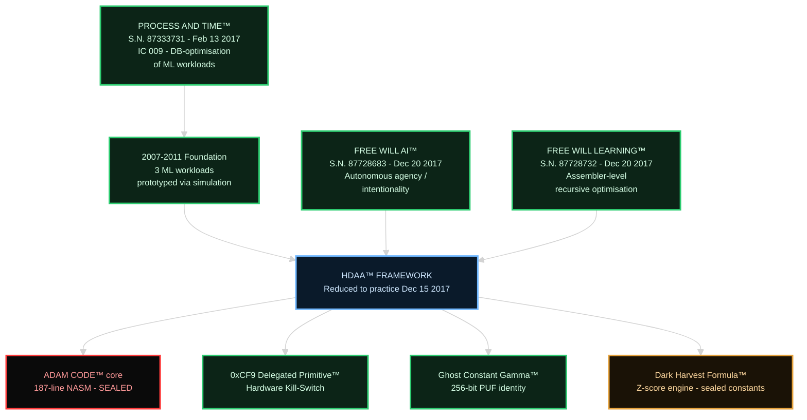
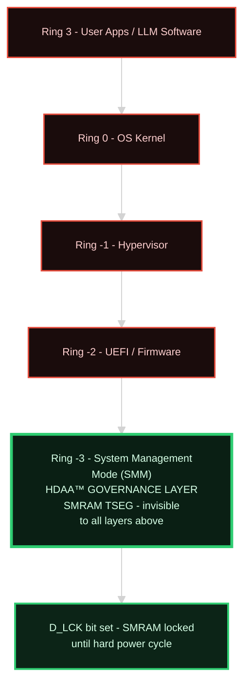
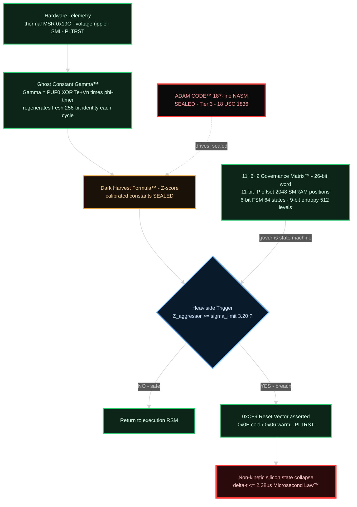
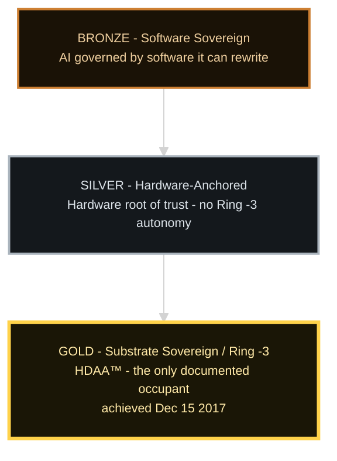

  <h1>&#129518; THE HDAA&trade; FRAMEWORK &mdash; COMPLETE HIERARCHICAL MAP</h1>
  <h2>Four-Tier Architecture: Trademark Lineage &middot; Ring Stack &middot; Execution Flow &middot; Sovereignty Stack</h2>
  

    <b>Master Anchor DOI (MDP V_01):</b> <a href="https://doi.org/10.5281/zenodo.18738911" target="_blank"><b>10.5281/zenodo.18738911</b></a> 
    <b>Substrate Bridge DOI (P25):</b> <a href="https://doi.org/10.5281/zenodo.18672039" target="_blank"><b>10.5281/zenodo.18672039</b></a>
  

 

<blockquote style="border-left: 4px solid #1f6feb; padding: 10px 18px; background: rgba(31,111,235,0.08);">
  
&#128270; <strong>HOW TO READ THIS MAP.</strong> Four tiers descend from legal origin to physical enforcement. <strong>Green</strong> nodes are Tier 1 &mdash; disclosed for prior-art purposes and independently replicable. <strong>Red / locked</strong> nodes are Tier 3 &mdash; sealed trade secrets under 18 U.S.C. &sect;&thinsp;1836, shown as locked boxes whose contents are never disclosed. <strong>Amber</strong> denotes a public formula with sealed calibration constants. The diagram itself enforces the 30/70 boundary: what is shown is the architecture; what is locked is the sovereign core.

</blockquote>

---

## &#127991;&#65039; TIER 1 — TRADEMARK LINEAGE (THE FEDERAL TIMESTAMP CHAIN)

The three 2017 USPTO marks and the HDAA&trade; components each one maps to (P11 Tables 4.3a / 4.3b). Every component descends from a dated federal mark.

---

## &#9881;&#65039; TIER 2 — RING / LAYER STACK (WHERE GOVERNANCE LIVES)

Everything the industry defends sits in Rings 3&rarr;0. HDAA&trade; governs from Ring -3 / Layer 0-1 &mdash; below the OS, the hypervisor, and firmware.

---

## &#128268; TIER 3 — EXECUTION FLOW (TELEMETRY &rarr; VETO &rarr; COLLAPSE)

The real-time enforcement loop, bounded by the 2.38&mu;s Microsecond Law&trade;. Sealed scoring internals shown locked; the 11+6+9 Governance Matrix&trade; is disclosed per P14a.

---

## &#127942; TIER 4 — THREE-TIER SOVEREIGNTY STACK&trade; (POSITIONING)

Where HDAA&trade; sits in the field of substrate governance.

 

  
<b>Return to <a href="../README.md">&#127968; Master Pillar (README)</a> &nbsp;|&nbsp; <a href="./ARCHITECTURE.md">&#9881;&#65039; PART III: TECHNICAL ARCHITECTURE</a></b>

